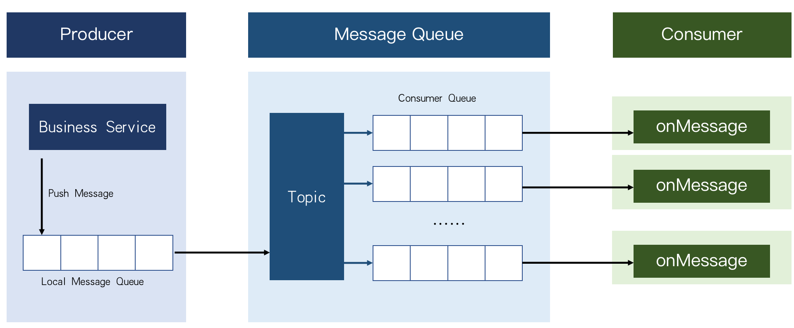

# message service
IC-MessageService is a message service middleware with a topic-subscription model.


In projects, we often face some situations that have to make some crossing canister calls, but crossing canister calls may cause some time consumption. In many scenarios, the system requires higher performance than real-time consistency. So in this case, we only need to ensure that the data is eventually consistent. For example, in ICPSwap, after each transaction, the transaction history will be stored to conduct data analysis. But it's not necessary to record it in real time after every transaction, we can just make sure that the transaction history will be stored finally. So we use message queue to achieve eventual consistency.

After we use the MQ, there are some problems:
- how to make no or less impact on the performance
- how to ensure that messages can be delivered
- how to ensure that messages are not sent or consumed repeatedly
- how to achieve messages being consumed by multiple consumers

There are three modules in IC-MessageService: Producer, MQ Server and Consumer.
Producer
On the producer side, we design a local message queue to store messages locally, so that we can improve message storage efficiency, and ensure that messages can be delivered to the message queue, and not be sent repeatedly
MQ Server
And in the MQ Server, we use a topic-subscription model, to allow multiple consumers to consume the same message queue. It has three modules too: producer management, topic management, and consumer management.
Consumer
On the consumer side, we provide a consumer SDK to ensure that messages will not be consumed repeatedly.



# Quick start
## Backend
```
dfx start --background
dfx deploy Broker
```

## Frontend
```
yarn install
yarn start
```

## Add Privilege

```
dfx canister call Broker addAdmin '(principal "xxx")'
```
