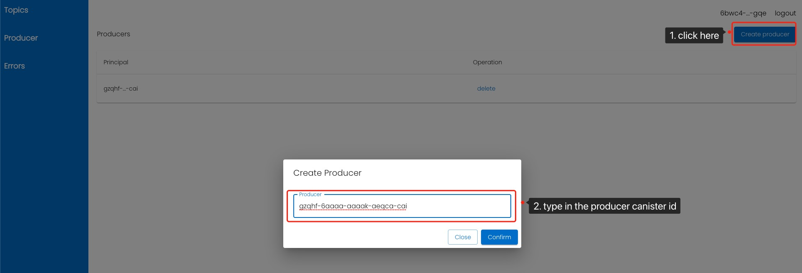
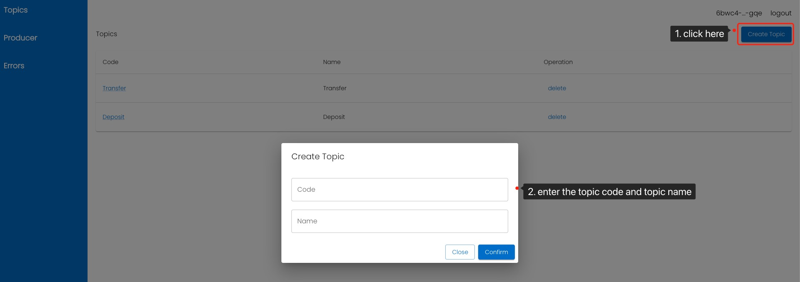
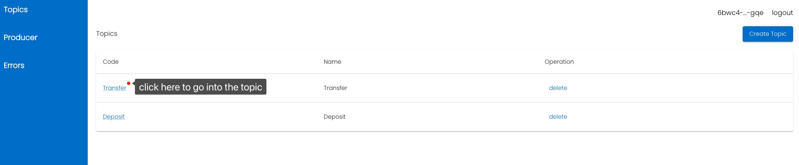
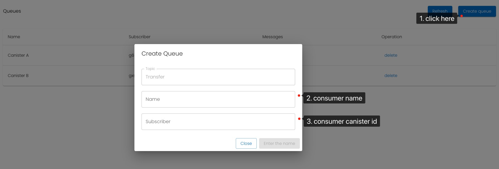
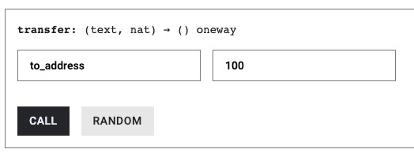
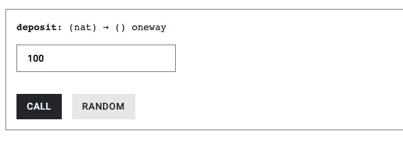
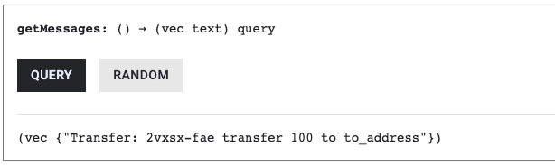
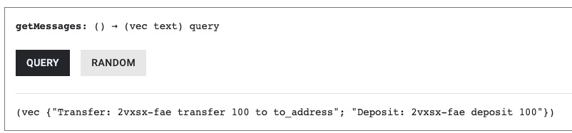

# Testing Script

Online Demo Link: https://h24od-kyaaa-aaaak-aeqeq-cai.icp0.io/

This management page can be logged on by Internet Identity or plug principal.

## Step 1
Add Producer: gzqhf-6aaaa-aaaak-aeqca-cai.

## Step 2

Add Topic: 'Transfer' and 'Deposit'. 

The parameter 'Code' will uniquely identify one topic in this MQ server.

## Step 3

Add Consumer: g6rbr-tyaaa-aaaak-aeqcq-cai and gxskn-fqaaa-aaaak-aeqda-cai.

Canister 'g6rbr-tyaaa-aaaak-aeqcq-cai' is named 'Canister A' and subscribes the topic 'Transfer'.

Canister 'gxskn-fqaaa-aaaak-aeqda-cai' is named 'Canister B' and subscribes the topic 'Transfer' and 'Deposit'.

## Step 4

Candid UI of producer:
https://a4gq6-oaaaa-aaaab-qaa4q-cai.raw.ic0.app/?id=gzqhf-6aaaa-aaaak-aeqca-cai

Call 'transfer' method to send a transfer message, input "to_address" and "100", after sending this message, Canister A and B can both receive the message.

Call 'deposit' method to send a deposit message, input "100", after sending this message, only Canister B can receive the message.

## Step 5

Check Messages in canister A: https://a4gq6-oaaaa-aaaab-qaa4q-cai.raw.ic0.app/?id=g6rbr-tyaaa-aaaak-aeqcq-cai

Check Messages in canister B: https://a4gq6-oaaaa-aaaab-qaa4q-cai.raw.ic0.app/?id=gxskn-fqaaa-aaaak-aeqda-cai

